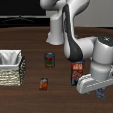
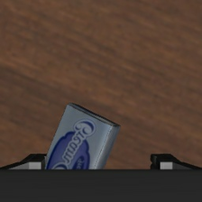
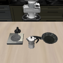
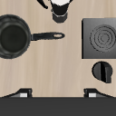
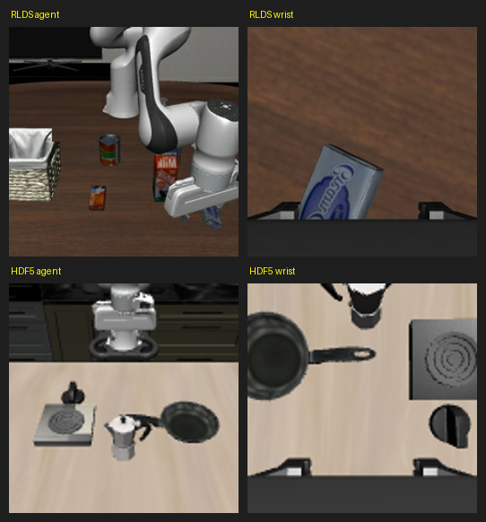

# RLDS ↔ HDF5 双视角 parity 图像门禁

Task 6 从两条数据流各取一帧 dump，验证图像朝向一致（核心：训练分布不能与 eval 不一致）。

- HDF5 原始帧倒置 → 代码翻 180° → 正立
- RLDS (`modified_libero_rlds`) 帧本就正立 → **不翻**
- 门禁通过标准：四张图全部正立，且 wrist 为手眼视角（夹爪在底部）

| | agent (主视角) | wrist (手眼) |
|---|---|---|
| **RLDS** |  |  |
| **HDF5** |  |  |

合成对比图：

注：RLDS 224×224、HDF5 128×128（原始存储分辨率，训练时都 resize 到 224）。两条流是不同 task/场景，重点看朝向而非内容是否相同。
